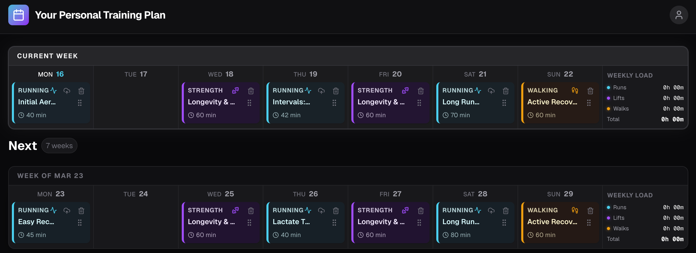
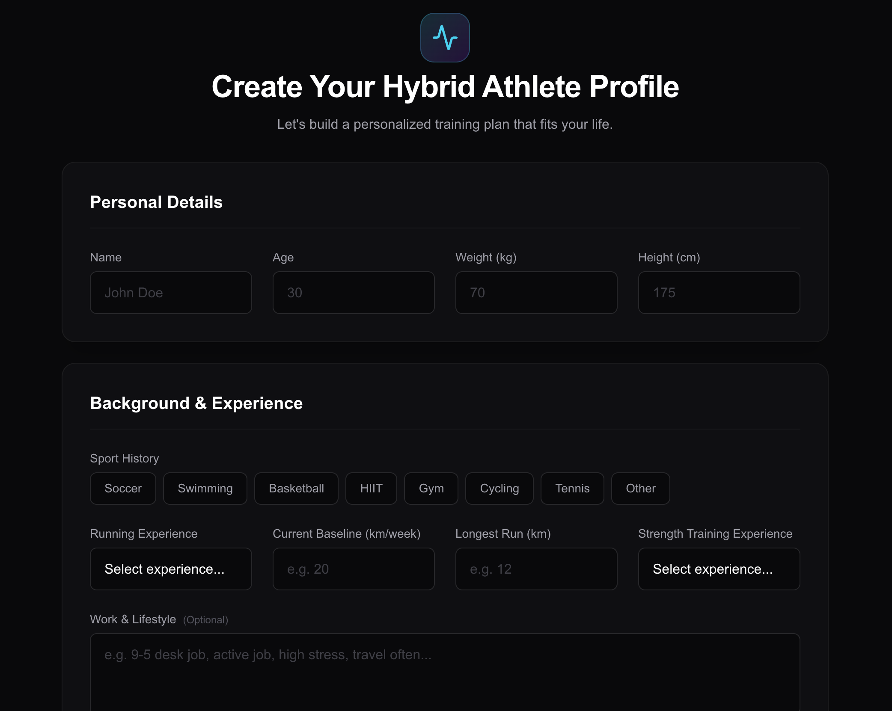
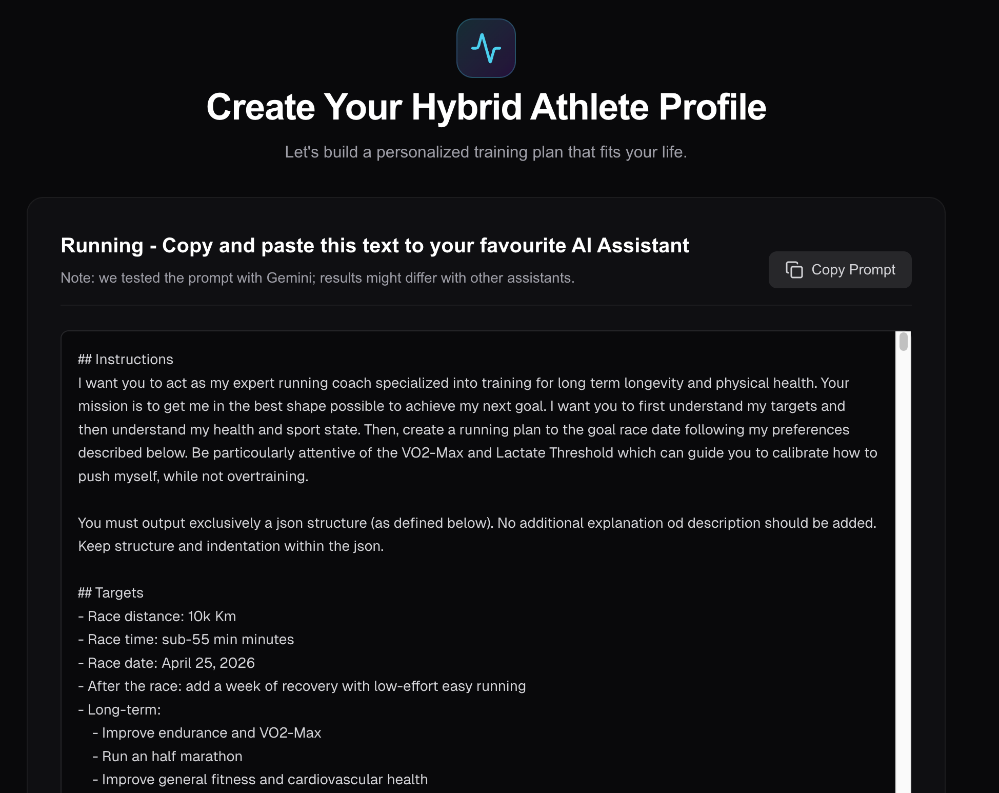
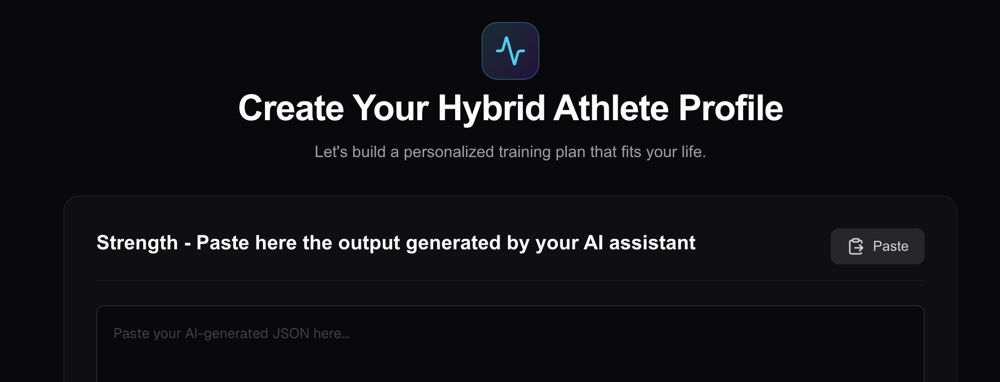
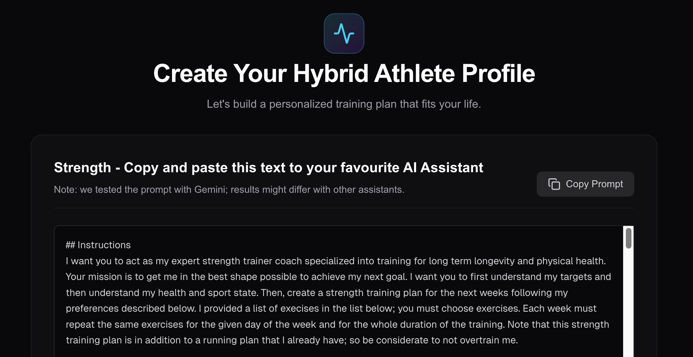
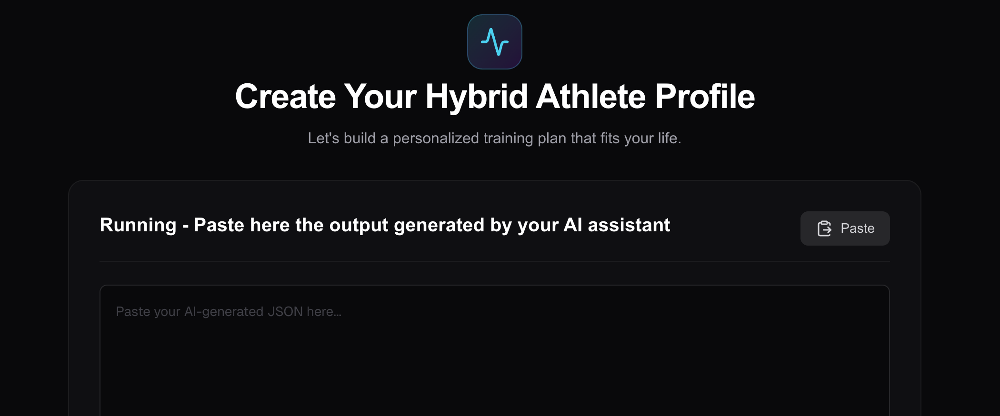

# 🏃‍♂️ Personal Hybrid Training Planner

Welcome to the **Personal Hybrid Training Planner**, created by [Loris Bazzani](https://lorisbaz.github.io/).

I created this application because existing fitness apps lack of true personalization and force you to view your training in silos, which I personally found quite rigid and not fulfilling my specific needs. If you are a hybrid athlete who runs, lifts, and walks, most apps don't give you a unified view. Worse, very few apps allow you to upload custom workouts to your Garmin watch, forcing you to rely on rigid, unadaptable programs

This planner leverages the power of AI to build highly personalized, multi-week training plans tailored to your specific goals, schedule, and current fitness level, and lets you push your running workouts directly to Garmin Connect.



## ✨ Features
- **Personalized AI Plans**: Uses advanced prompt engineering to generate custom X-week plans for Running and Strength training based on your preferences.
- **Hybrid Training View**: See your runs, strength sessions, and active recovery walks in a beautiful, unified drag-and-drop calendar.
- **Direct Garmin Upload**: Say goodbye to manual workout creation. Push your scheduled running intervals directly to your Garmin Connect calendar with one click. Currently available only for running activities.
- **Local & Secure**: Your data lives locally in a PostgreSQL database, and your credentials are safely stored in your system's secure keychain.

## 🚀 Getting Started (Local Development)

### Prerequisites
- **Node.js** (v18+ recommended)
- **PostgreSQL** running locally on the default port (5432). *(Note: The app will automatically create a local user-specific database for you upon setup!)*

### Installation

1. Clone the repository and navigate into the project directory.
2. Install the dependencies, build and launch the server:

```bash
npm install
npm run build
npm run start
```

3. Open [http://localhost:3000](http://localhost:3000) with your browser to see the result.
4. Optional Pro Tip: Setup [Tailscale](https://tailscale.com/) to access your local server from your phone or other devices.


## 📚 User Guide

1) Fill out the profile creation page with personal details, background, targets, and schedule.

2) Copy and paste this text to your favourite AI Assistant Note: we tested the prompt with Gemini; results might differ with other assistants.

3) Paste here the output generated by your AI assistant.

4) Copy and paste this text to your favourite AI Assistant Note: we tested the prompt with Gemini; results might differ with other assistants.

5) Paste here the output generated by your AI assistant.

6) Enjoy your plan :) 